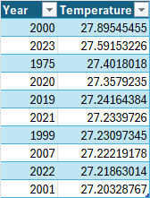
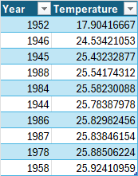
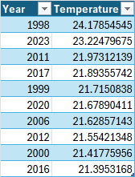
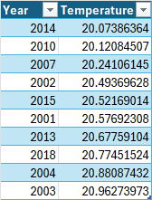

#### This scripts generates top 10 hottest and coldest years based on the historical data provided by Kaggle for cities all around the world

#### [The Weather Dataset](https://www.kaggle.com/datasets/guillemservera/global-daily-climate-data)

##### Requirements Duckdb 
[DuckDB](https://duckdb.org/docs/guides/python/install.html)

``` pip install duckdb ```

#### Hottest average temperature for city of Karachi Pakistan based on data since 1942


#### Coldest average temperature for city of Karachi Pakistan based on data since 1942


#### Hottest average temperature for city of Austin USA


#### Coldest average temperature for city of Austin USA
